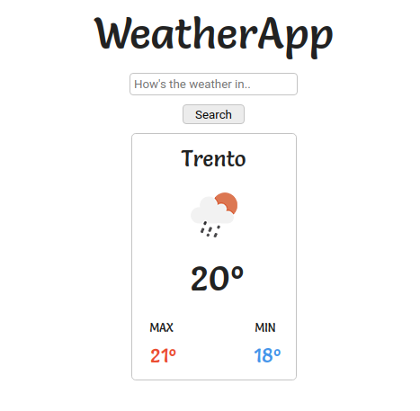

# Weather App

Simple weather application that shows the weather of a location.

It uses APIs to fetch data from [OpenWeather](https://openweathermap.org/current), like location, temperatures, humidity, etc...
The main goal of this is to improve my skill with APIs and build knowledge and gain more confidence with my asynchronous javascript skills

<div align="center">
  
</div>

## Installation

Clone the repository.

```shell
git clone https://github.com/igorbanjac91/WeatherApp.git
```

Install all the dependencies.

```shell
npm install # or yarn install
```

Get your API key from [OpenWeather](https://openweathermap.org/).

Go to the website and Sing up, then go to your profile and copy your API key.

Create a file called .env, add the following content and paste your API key in place of YOUR_API_KEY.

```config
API_KEY=YOUR_API_KEY
```

Run it.

```shell
npm run start # or yarn run install
```

Finally, create a .gitignore file and add your .env file so that you don't push your secret key to GitHub
even if this API is free for public use, keep the habit of keeping this kind of information private.

## License

This project is MIT licensed.
